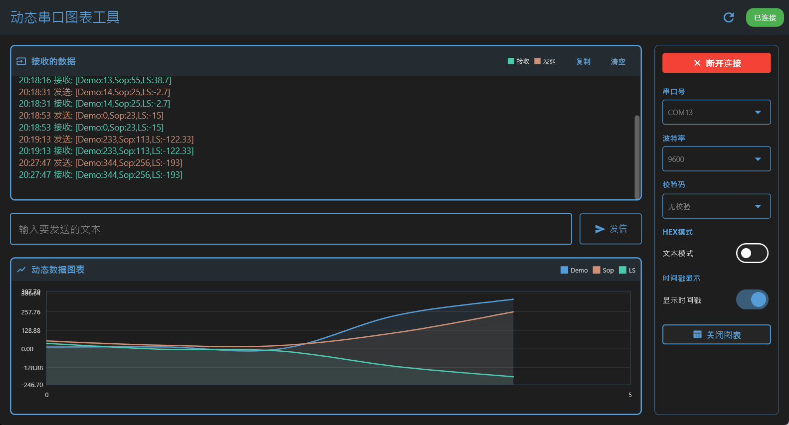

# Flutter动态串口图表工具

一个基于Flutter开发的跨平台串口通信调试工具，集成了实时数据可视化功能，支持Android和Windows平台。

## 功能特性

### 串口通信
- **完整参数配置**：波特率、数据位、停止位、校验位可调
- **智能数据解析**：支持UTF-8、ASCII、Latin1多种编码自动识别
- **HEX/文本模式**：支持十六进制和文本两种数据格式显示



### 数据可视化
- **实时动态图表**：自动解析数据并生成趋势图表
- **多数据流支持**：同时显示多个数据序列，不同颜色区分
- **智能数据提取**：支持`[key:value]`格式数据自动识别
- **可配置显示范围**：动态调整图表数据点数量

### WebSocket远程控制
- **WebSocket服务器**：支持通过WebSocket协议远程控制串口收发
- **JSON命令API**：支持连接、断开、发送数据等命令
- **实时状态同步**：串口状态实时同步到WebSocket客户端
- **双向数据传输**：支持串口数据转发到WebSocket和WebSocket数据发送到串口

### 用户界面
- **VSCode风格主题**：深色界面，护眼舒适
- **实时数据监控**：接收/发送数据分色显示，带时间戳
- **响应式布局**：适配不同屏幕尺寸
- **一键操作**：连接、发送、清空等操作便捷

## WebSocket远程控制

本工具集成了WebSocket服务器，支持通过WebSocket协议远程控制串口收发。WebSocket服务器默认运行在端口9090。

### WebSocket API

#### 命令格式
所有命令都使用JSON格式发送：
```json
{
  "command": "命令名称",
  "data": {
    // 命令参数
  }
}
```

#### 支持的命令

1. **连接串口**
```json
{
  "command": "connect",
  "data": {
    "port": "/dev/ttyUSB0",
    "baudRate": 9600,
    "dataBits": 8,
    "stopBits": 1,
    "parity": "none"
  }
}
```

2. **断开串口**
```json
{
  "command": "disconnect",
  "data": {}
}
```

3. **列出可用端口**
```json
{
  "command": "list_ports",
  "data": {}
}
```

4. **发送文本数据**
```json
{
  "command": "send_text",
  "data": {
    "message": "Hello UART"
  }
}
```

5. **发送HEX数据**
```json
{
  "command": "send_hex",
  "data": {
    "hex": "48656C6C6F"
  }
}
```

6. **设置串口配置**
```json
{
  "command": "set_config",
  "data": {
    "baudRate": 115200,
    "dataBits": 8,
    "stopBits": 1,
    "parity": "none"
  }
}
```

7. **设置HEX模式**
```json
{
  "command": "set_hex_mode",
  "data": {
    "enabled": true
  }
}
```

8. **设置图表模式**
```json
{
  "command": "set_chart_mode",
  "data": {
    "enabled": true
  }
}
```

#### 响应格式
所有响应都使用以下格式：
```json
{
  "type": "响应类型",
  "data": {
    // 响应数据
  }
}
```

响应类型包括：
- `command_response`: 命令执行结果
- `error`: 错误信息
- `port_status`: 串口状态
- `data_received`: 接收到的串口数据

### WebSocket测试客户端

项目中包含一个HTML测试客户端 `lib/websocket_test_client.html`，可以用于测试WebSocket功能。

## 高级功能

### 数据缓冲机制
- 智能数据包重组，处理粘包问题
- 超时自动处理，确保数据完整性
- 缓冲区溢出保护，自动清理

### 性能优化
- 数据量限制，防止内存溢出
- 图表渲染优化，流畅显示
- 异步处理，避免界面卡顿

## 故障排除

### 常见问题
1. **端口无法识别**
   - 检查设备驱动安装
   - 确认USB调试权限

2. **数据乱码**
   - 检查波特率等参数匹配
   - 验证数据编码格式

3. **图表不显示**
   - 确认数据格式符合要求
   - 检查数据键值命名

4. **WebSocket连接失败**
   - 确认应用已启动且WebSocket服务器运行
   - 检查端口8080是否被其他应用占用
   - 验证网络连接和防火墙设置

## 贡献指南

欢迎提交Issue和Pull Request来改进项目功能。

## 许可证

本项目采用MIT授权,允许商用

(如果可以的话提交点PR帮助改进该项目就最好了)

---

**注意**：Windows平台使用时需要安装对应的串口驱动程序，否则可能无法识别设备端口。

## 特别注意事项:提交PullRequest
